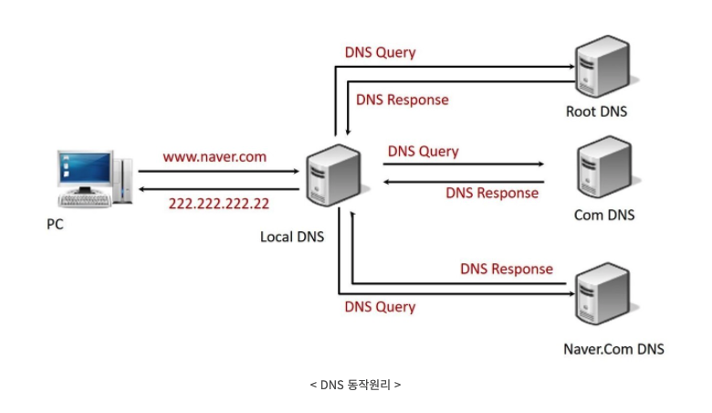

# 웹의 동작 방식

브라우저에 웹 주소를 입력하면

1. 브라우저는 DNS 서버로 가서 웹사이트가 있는 서버의 진짜 주소를 찾는다
2. 그 다음 브라우저는 서버에게 웹사이트의 사본을 클라이언트에게 보내달라는 HTTP요청을 서버로 전송한다. 이 때, 클라이언트와 서버 사이에 전송되는 모든 데이터는 TCP/IP 연결을 통해 전송된다
3. 요청을 받은 서버는 웹사이트의 파일들을 데이터 패킷이라 불리는 단위로 브라우저에게 전송한다.
4. 브라우저는 이 데이터들을 완전한 웹 사이트로 조립하여 보여준다.

### DNS(Domain Name System Servers)

- 도메인 웹주소와 웹사이트의 실제 IP주소를 맞춰주는 서버

- 구성 요소 및 동작 원리

  - 

  - DNS 동작과정

    1. DNS Query (from Web Browser to Local DNS) : "제가 원하는 웹 사이트의 IP 주소를 알고 계신가요?" Local DNS 서버에게 전달

    2. DNS Query (from Local DNS to Root DNS) : "제가 원하는 웹 사이트의 IP 주소를 알고 계신가요?" Root DNS서버에게 전달

    3. DNS Response (from Root DNS to Local DNS) : "저는 모르지만 , Com 도메인을 관리하는 네임서버의 이름과 IP 주소를 알려드릴 테니 거기에 물어보세요"

    4. DNS Query (from Local DNS to com NS) : “ 안녕하세요. www. naver. com의 IP 주소를 알고 계신가요?"

    5. DNS Response (from com NS to Local DNS) : "저는 모르지만 , Com 도메인을 관리하는 네임서버의 이름과 IP 주소를 알려드릴 테니 거기에 물어보세요"

    6. DNS Query (from Local DNS to naver. com NS) : “ 안녕하세요. www. Naver .com의 IP 주소를 알고 계신가요?"

    7. DNS Response (from naver .com NS to Local DNS) : "저는 모르지만 해당 웹은 www. g.naver. com이라는 이름으로 통해요. g.naver .com 도메인을 관리하는 네임서버의 이름과 IP 주소를 알려드릴테니 거기에 물어보세요"

    8. DNS Query (from Local DNS to g.naver. com NS) : “ 안녕하세요. www. g.naver. com의 IP 주소를 알고 계신가요?"

    9. DNS Response (from g.naver .com NS to Local DNS) : " 네 www. g.naver .com의 IP 주소는 222.222.222.22와 333.333.333.33입니다"

    10. DNS Response (from Local DNS to Web Browser) : "네 www. naver .com의 IP 주소는 222.222.222.22와 333.333.333.33입니다"

### 패킷

- 데이터가 웹을 거쳐서 전송될 때, 수천 개의 작은 덩어리로 전송된다. 만약 하나의 큰 덩어리로 전송된다면, 한 번에 하나의 사용자만 다운로드 할 수 있을 것이다.

참조:

[https://developer.mozilla.org/ko/docs/Learn/Getting_started_with_the_web/How_the_Web_works](https://developer.mozilla.org/ko/docs/Learn/Getting_started_with_the_web/How_the_Web_works)

[https://ja-gamma.tistory.com/entry/DNS%EA%B0%9C%EB%85%90%EB%8F%99%EC%9E%91%EC%9B%90%EB%A6%AC](https://ja-gamma.tistory.com/entry/DNS%EA%B0%9C%EB%85%90%EB%8F%99%EC%9E%91%EC%9B%90%EB%A6%AC)
